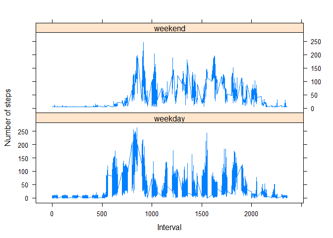

## Loading and preprocessing the data

```r
# Load the project data

unzip("activity.zip")
project <- read.csv("activity.csv", stringsAsFactors=FALSE)

# Transform the date to date format
project$date <- as.POSIXct(project$date, format="%Y-%m-%d")

# Compute the weekdays from the date attribute
project<- data.frame(date=project$date, 
                           weekday=tolower(weekdays(project$date)), 
                           steps=project$steps, 
                           interval=project$interval)

# Compute the day type (weekend or weekday)
project <- cbind(project, 
                      daytype=ifelse(project$weekday == "domingo" | 
                                     project$weekday == "sábado", "weekend", 
                                     "weekday"))

# Create the final data.frame
project_dt <- data.frame(date=project$date, 
                       weekday=project$weekday, 
                       daytype=project$daytype, 
                       interval=project$interval,
                       steps=project$steps)
```
## What is mean total number of steps taken per day?

```r
# Generating the number of steps each day (NA values removed)
sum_data <- aggregate(project_dt$steps, by=list(project_dt$date), FUN=sum, na.rm=TRUE)

# Rename the attributes
names(sum_data) <- c("date", "total")

# Creating the histogram of the total number of steps each day
hist(sum_data$total, 
     breaks=seq(from=0, to=25000, by=2500),
     col="gray", 
     xlab="Total number of steps", 
     ylim=c(0, 20), 
     main="Histogram of the total number of steps taken each day\n(NA removed)")
```

<!-- -->

```r
#Calculate and report the mean and median total number of steps taken per day
mean(sum_data$total)
```

```
## [1] 9363.117
```

```r
median(sum_data$total)
```

```
## [1] 10417
```
## What is the average daily activity pattern?

```r
# Calculating the means of steps across all days for each interval
mean_data <- aggregate(project_dt$steps, 
                       by=list(project_dt$interval), 
                       FUN=mean, 
                       na.rm=TRUE)

# Rename the attributes
names(mean_data) <- c("interval", "mean")

# Creating the time series plot
plot(mean_data$interval, 
     mean_data$mean, 
     type="l", 
     col="blue", 
     lwd=2, 
     xlab="Interval [minutes]", 
     ylab="Average number of steps", 
     main="Time-series of the average number of steps per intervals\n(NA removed)")
```

<!-- -->

```r
#Which 5-minute interval, on average across all the days in the dataset, contains the maximum number of steps?

# We find the position of the maximum mean
max_pos <- which(mean_data$mean == max(mean_data$mean))

# We lookup the value of interval at this position
max_interval <- mean_data[max_pos, 1]
max_interval
```

```
## [1] 835
```
## Imputing missing values

```r
# We use the trick that a TRUE boolean value is equivalent to 1 and a FALSE to 0.
NA_count <- sum(is.na(project_dt$steps))

# Find the NA positions
na_pos <- which(is.na(project_dt$steps))

# Create a vector of means
mean_vec <- rep(mean(project_dt$steps, na.rm=TRUE), times=length(na_pos))

# Replace the NAs by the means
project_dt[na_pos, "steps"] <- mean_vec

# Clear the workspace
rm(mean_vec, na_pos)

# Compute the total number of steps each day (NA values removed)
sum_data <- aggregate(project_dt$steps, by=list(project_dt$date), FUN=sum)

# Rename the attributes
names(sum_data) <- c("date", "total")

# Compute the histogram of the total number of steps each day
hist(sum_data$total, 
     breaks=seq(from=0, to=25000, by=2500),
     col="blue", 
     xlab="Total number of steps", 
     ylim=c(0, 30), 
     main="Histogram of the total number of steps taken each day\n(NA replaced by mean value)")
```

<!-- -->


## Are there differences in activity patterns between weekdays and weekends?

```r
# Load the lattice graphical library
library(lattice)

# Calculating the average number of steps taken, averaged across all daytype variable
mean_data <- aggregate(project_dt$steps, 
                       by=list(project_dt$daytype, 
                               project_dt$weekday, project_dt$interval), mean)

# Rename the attributes
names(mean_data) <- c("daytype", "weekday", "interval", "mean")

# Creating the time serie plot
xyplot(mean ~ interval | daytype, mean_data, 
       type="l", 
       lwd=1, 
       xlab="Interval", 
       ylab="Number of steps", 
       layout=c(1,2))
```

<!-- -->
